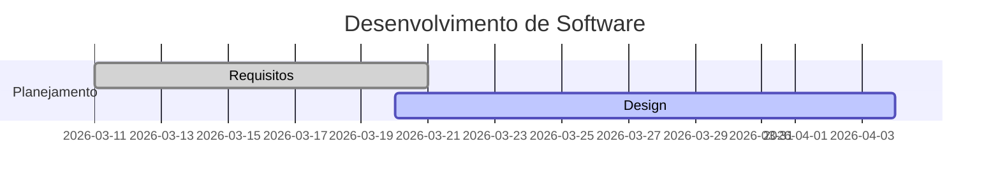

```mermaid
gantt

%%%Definir titulo principal
title Desenvolvimento de Software
%%% Definir o formato data (Ano-mes-dia)
dateFormat YYYY-MM-DD

%%%Criação do agrupamento visual para as tarefasn  iniciais
section Planejamento
%%%'done' : Tarefa concluida (fica cinza). 'req' é o ID da
%%%Tarefa - 2026-03-11 'data de inicio' 10 d 'duracao'
Requisitos : done,req, 2026-03-11, 10d

%%%'active' Tarefa em andamento
Design: active,des, 2026-03-20, 15d

section Desenvolvimento

```
